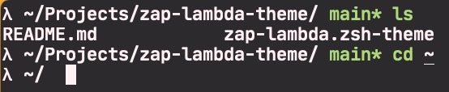

# zap-lambda-theme

It is a port of the `lambda` theme from ohmyzsh for pure zsh. The theme includes a prompt that displays the current directory, the git branch (if applicable) and repository status

## Install
### zsh
`git clone https://github.com/famiclone/zsh-lambda-theme.git <your_dir>` - Clone repo
`echo "source <your_dir>/zsh-lambda-theme/lambda.zsh-theme"`
### zap
Add line to your `.zshrc`
`plug "famiclone/zsh-lambda-theme"`
